# Easy_web_site
## Project #1 (CSS,HTML,JavaScript)

### Main page

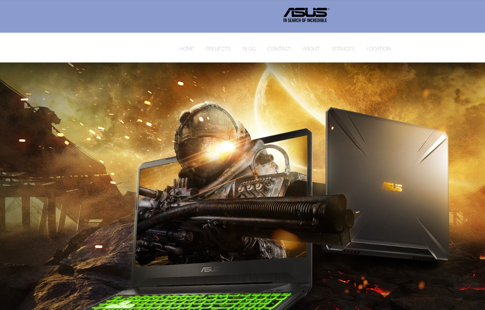
### Projects page
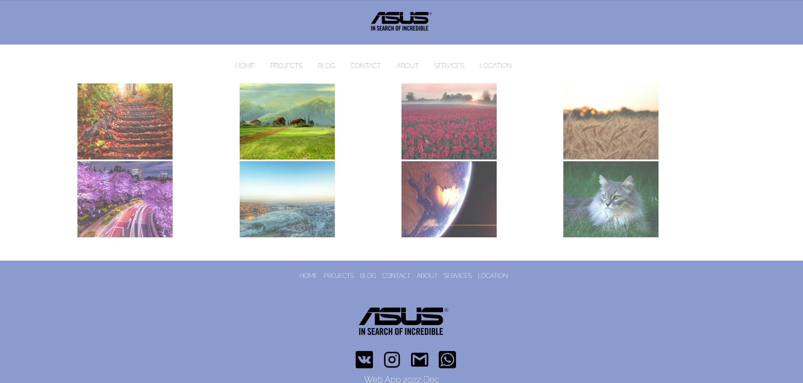

### Contact page
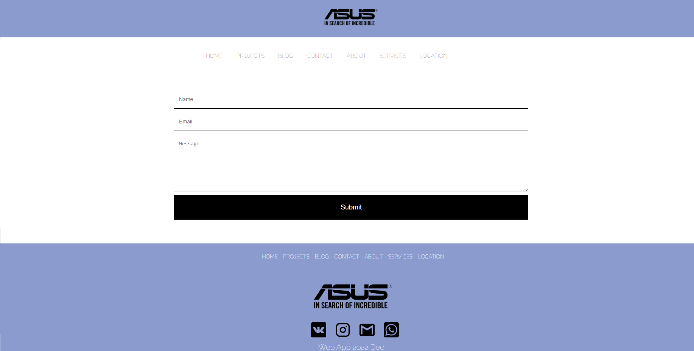

### Blog page
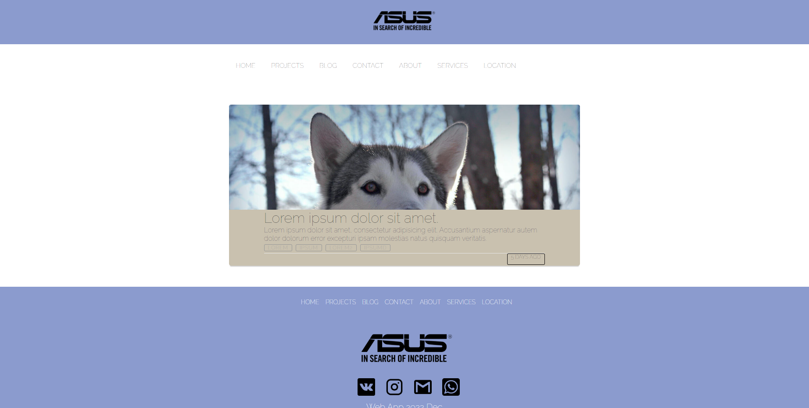

## Project #2 (CSS,HTML,JavaScript)

### Main page

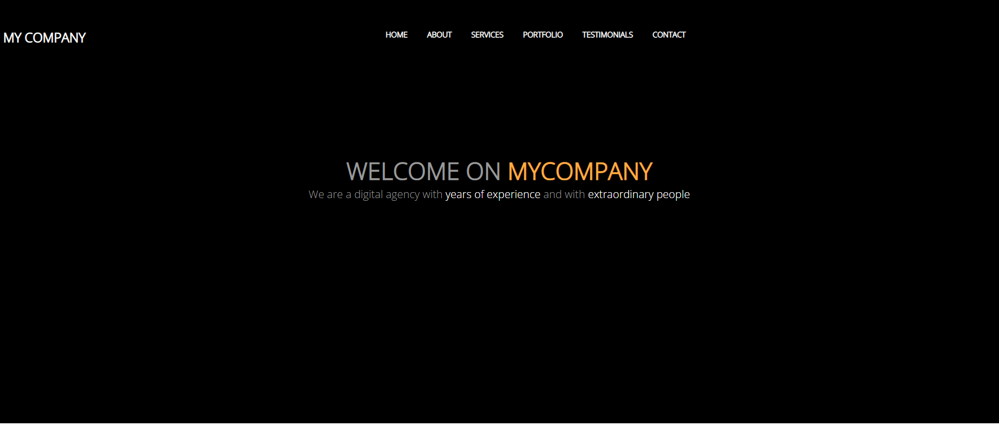
### Command page
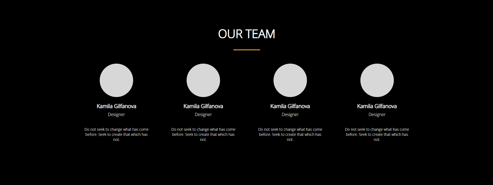

## Project #3 (CSS,HTML,JavaScript)
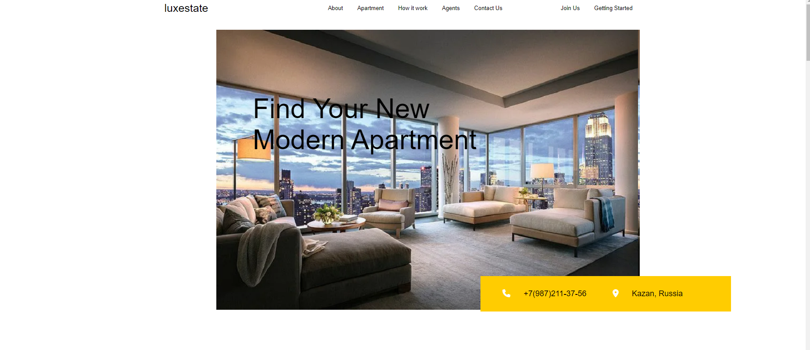
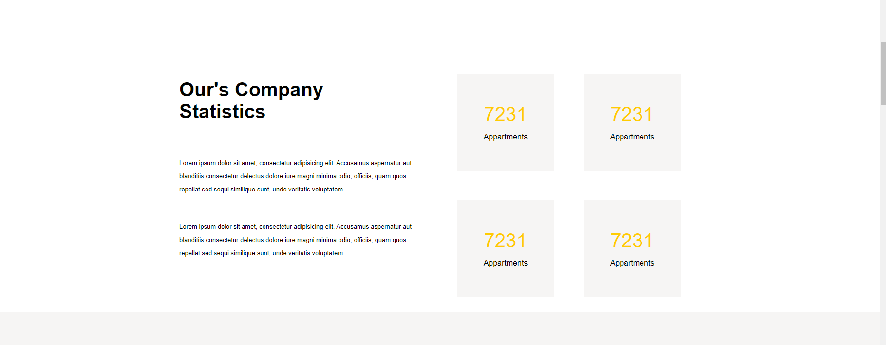
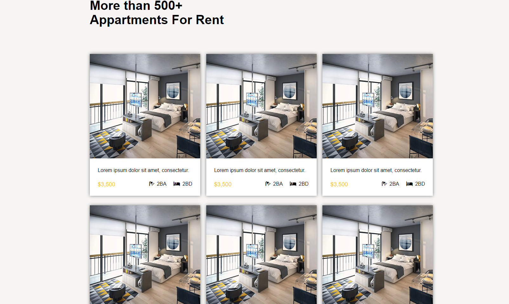
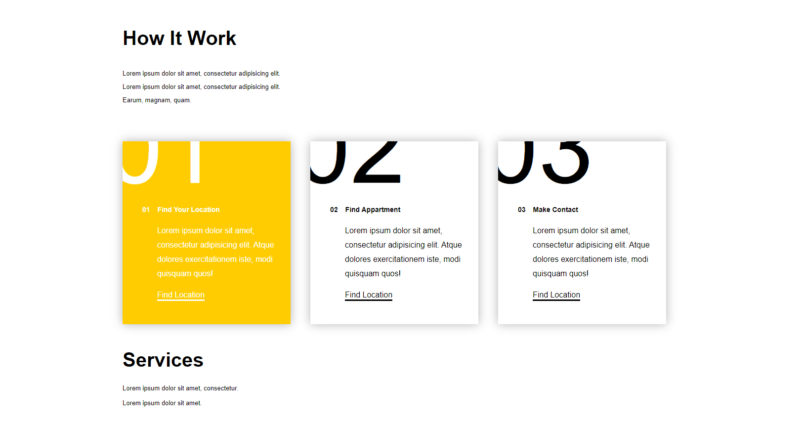
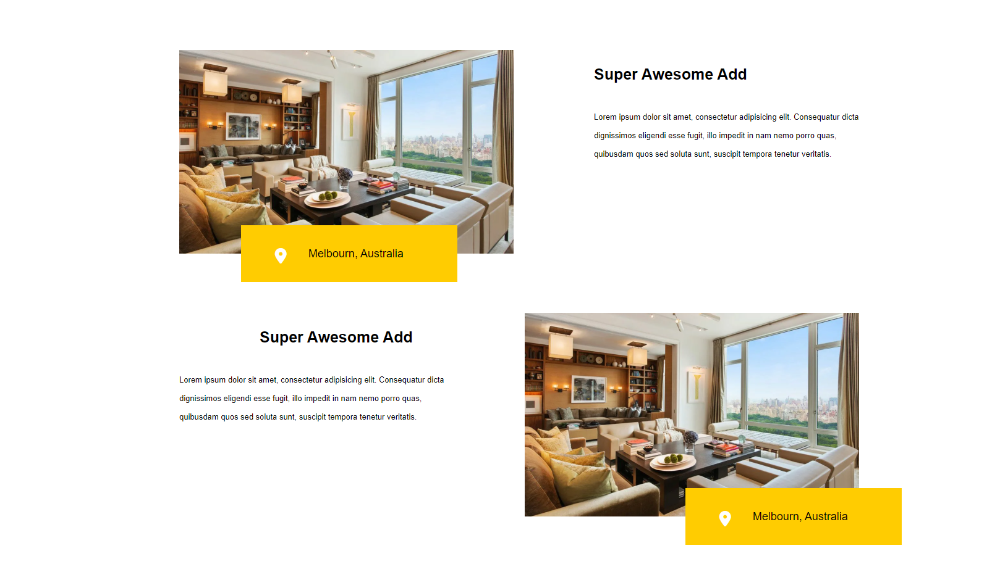

## Project #4 (CSS,HTML,JavaScript)

About this project you can read more in directory ./projectr4

## Project #5 (CSS,HTML,JavaScript(Vue))
Слайдер с анимацией написанный на Vue

## Project #5 (CSS,HTML,JavaScript(Vue))
Статья с динамически вылезающим меню(адаптиваня верстка)

